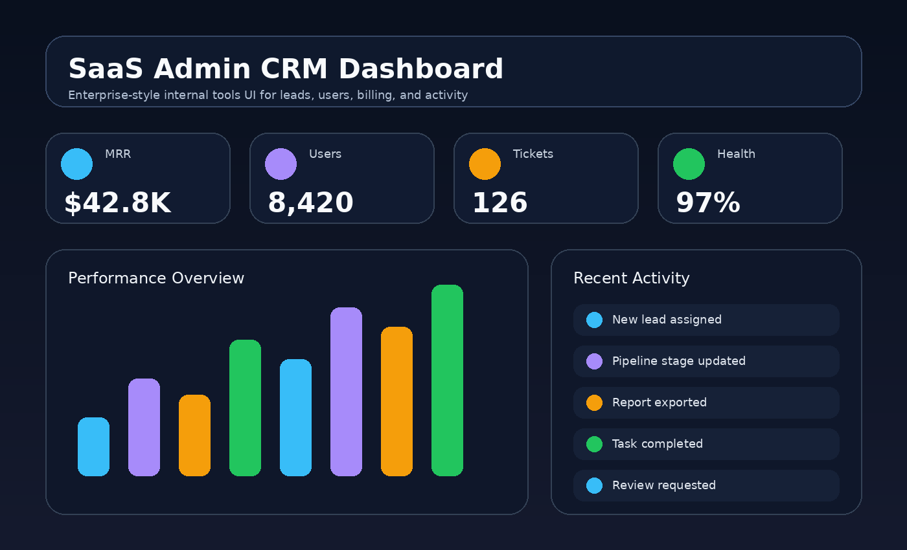

# SaaS Admin CRM Dashboard

> A modern SaaS admin CRM dashboard with customer management, subscription tracking, revenue KPIs, pipeline insights, support activity, and responsive enterprise-style UI.

Built by **Arsim Shefkiu** under **FullStackWithAI** — full-stack, AI-assisted, and data-driven web solutions.



## Overview

A polished admin CRM dashboard built for full-stack/frontend roles. It demonstrates enterprise UI thinking, KPI cards, pipeline management, searchable records, billing status, responsive layout, and clean component structure.

## Why this project exists

This repository is designed to be visible and understandable to recruiters in the first 30 seconds. It shows practical product thinking, clean front-end structure, responsive UI execution, and business/data awareness.

## Features

- Executive KPI cards for revenue, users, churn, and support load
- Lead pipeline and recent activity modules
- Searchable customer table with status badges
- Responsive enterprise layout for desktop, tablet, and mobile
- No framework dependency; easy to migrate to React

## Tech Stack

- HTML5
- CSS3
- Vanilla JavaScript
- Responsive layout
- Mock dataset / client-side interactions

## Project Structure

```text
saas-admin-crm-dashboard/
├── index.html
├── assets/
│   ├── styles.css
│   ├── app.js
│   └── screenshot.png
└── README.md
```

## How to Run

Open `index.html` directly in your browser, or run a simple local server:

```bash
python -m http.server 5173
```

Then open:

```text
http://localhost:5173
```

## Recruiter Notes

This project is intentionally built as a polished portfolio piece. It demonstrates:

- UI/UX judgment
- Responsive front-end implementation
- Business dashboard thinking
- Clean file organization
- Ability to turn an idea into a product-like interface

## Future Improvements

- Convert to React components
- Add API data loading
- Add authentication and protected routes
- Persist data in a database
- Add automated tests

---

## Creator & Brand

<p align="center">
  
  
  
</p>

### Built by **Arsim Shefkiu** under **FullStackWithAI**

> **Enterprise dashboard thinking for SaaS products, customer operations, subscription workflows, and revenue visibility.**

| Brand Direction | Portfolio Value |
|---|---|
| **Enterprise SaaS UI** | Shows ability to build serious admin systems, not just landing pages |
| **CRM + revenue operations** | Demonstrates business understanding around customers, pipeline, churn, and subscriptions |
| **Executive KPI design** | Communicates performance data quickly for founders, managers, and operators |
| **Scalable product thinking** | Positions the project as a foundation for real SaaS dashboards |

**Professional Focus:** I build polished SaaS-style dashboards that combine clean frontend execution, operational clarity, KPI-first layouts, and AI-assisted development speed.

**Why it matters:** Hiring managers and CEOs can see the ability to design interfaces that support real business operations, not just visual decoration.

<p align="center">
  <a href="https://www.designhubmk.com"><strong>www.designhubmk.com</strong></a> · <strong>arsim@designhubmk.com</strong> · <a href="https://github.com/fullstackwithai"><strong>GitHub: fullstackwithai</strong></a>
</p>

<p align="center">
  <strong>FullStackWithAI</strong> · SaaS dashboards · CRM systems · Revenue operations · AI-assisted product thinking
</p>
